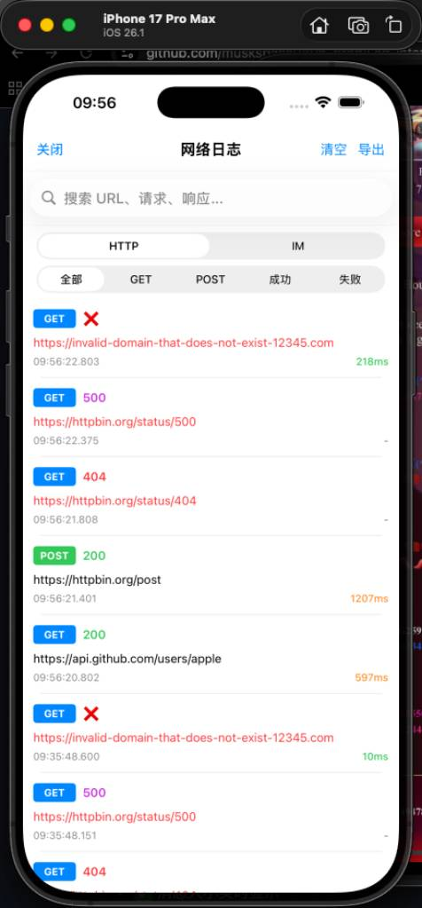

# NetworkDebugger

[](https://cocoapods.org/pods/NetworkDebugger)
[](https://cocoapods.org/pods/NetworkDebugger)
[](https://cocoapods.org/pods/NetworkDebugger)

一个功能强大的 iOS 网络调试工具，支持 HTTP/HTTPS 和 WebSocket 拦截。

[English](README.md) | [中文文档](README_CN.md)

## 功能特性

- ✅ 拦截所有 URLSession 网络请求
- ✅ 支持 WebSocket 拦截（SocketRocket）
- ✅ 实时查看请求和响应
- ✅ JSON 自动格式化
- ✅ 搜索和过滤功能
- ✅ 导出日志为 JSON
- ✅ 可拖拽的悬浮按钮
- ✅ 零配置，开箱即用
- ✅ 仅在 Debug 模式下工作

## 预览

<table>
  <tr>
    <td></td>
    <td></td>
    <td></td>
    <td></td>
  </tr>
</table>

## 安装

### CocoaPods

在你的 `Podfile` 中添加：

```ruby
# 仅在 Debug 模式下使用
pod 'NetworkDebugger', :configurations => ['Debug']
```

然后运行：

```bash
pod install
```

### Swift Package Manager

```swift
dependencies: [
    .package(url: "https://github.com/yourusername/NetworkDebugger.git", from: "1.0.0")
]
```

### 手动安装

将 `NetworkDebugger/Classes` 文件夹拖入你的项目。

## 快速开始

### 基础使用

在 `AppDelegate.swift` 中：

```swift
import NetworkDebugger

func application(_ application: UIApplication, didFinishLaunchingWithOptions launchOptions: [UIApplication.LaunchOptionsKey: Any]?) -> Bool {
    
    // 方式 1: 仅在 Debug 模式下自动启动
    NetworkDebugger.startIfDebug()
    
    // 方式 2: 手动启动
    #if DEBUG
    NetworkDebugger.shared.start()
    #endif
    
    return true
}
```

就这么简单！现在运行你的应用，你会在右下角看到一个蓝色的悬浮按钮 📊。

### 高级配置

```swift
import NetworkDebugger

// 自定义配置
var config = NetworkDebugger.Configuration()
config.showFloatingButton = true          // 显示悬浮按钮
config.interceptHTTP = true               // 拦截 HTTP 请求
config.interceptWebSocket = true          // 拦截 WebSocket
config.maxRecords = 1000                  // 最大记录数
config.floatingButtonPosition = .bottomRight  // 按钮位置

NetworkDebugger.shared.start(with: config)

// 或者使用便捷方法
NetworkDebugger.start(
    showFloatingButton: true,
    interceptHTTP: true,
    interceptWebSocket: true,
    maxRecords: 500
)
```

## 使用方法

### 查看日志

1. **点击悬浮按钮** - 打开日志列表
2. **切换 HTTP/IM** - 查看不同类型的日志
3. **点击列表项** - 查看详细信息
4. **搜索和过滤** - 快速找到目标请求

### 编程方式访问

```swift
// 显示日志页面
NetworkDebugger.shared.showLogViewController()

// 获取所有 HTTP 请求
let requests = NetworkDebugger.shared.getAllHTTPRequests()

// 获取所有 WebSocket 消息
let messages = NetworkDebugger.shared.getAllWebSocketMessages()

// 清空日志
NetworkDebugger.shared.clearAllLogs()

// 导出日志
if let json = NetworkDebugger.shared.exportLogsAsJSON() {
    print(json)
}

// 停止调试工具
NetworkDebugger.shared.stop()
```

## 支持的网络库

### HTTP/HTTPS
- ✅ URLSession (原生)
- ✅ Alamofire
- ✅ AFNetworking
- ✅ 其他基于 URLSession 的库

### WebSocket
- ✅ SocketRocket
- ⚠️ URLSessionWebSocketTask (需要额外配置)
- ✅ 其他基于 NSStream 的实现

## 最佳实践

### 1. 仅在 Debug 模式使用

```swift
#if DEBUG
NetworkDebugger.shared.start()
#endif
```

### 2. 使用编译条件

在 `Podfile` 中：

```ruby
pod 'NetworkDebugger', :configurations => ['Debug']
```

### 3. 自动清理

```swift
func applicationDidReceiveMemoryWarning(_ application: UIApplication) {
    #if DEBUG
    NetworkDebugger.shared.clearAllLogs()
    #endif
}
```

### 4. 自定义过滤

如果需要忽略某些请求：

```swift
// 在 NetworkInterceptor.swift 中
override class func canInit(with request: URLRequest) -> Bool {
    // 忽略特定域名
    if request.url?.host?.contains("analytics.com") == true {
        return false
    }
    return true
}
```

## 注意事项

⚠️ **重要提示**

1. **仅用于开发/测试** - 不要在生产环境启用
2. **性能影响** - 拦截会略微增加网络请求开销
3. **内存占用** - 大量请求会占用内存，定期清空日志
4. **隐私安全** - 日志可能包含敏感信息，注意保护
5. **App Store** - 上架前确保已禁用或移除

## 系统要求

- iOS 13.0+
- Xcode 12.0+
- Swift 5.0+

## 示例项目

克隆仓库并运行示例项目：

```bash
git clone https://github.com/yourusername/NetworkDebugger.git
cd NetworkDebugger/Example
pod install
open NetworkDebuggerExample.xcworkspace
```

## 常见问题

### Q: 为什么看不到某些请求？

A: 可能是使用了 CFNetwork 或原始 Socket 连接，URLProtocol 无法拦截。

### Q: 如何拦截 WKWebView 的请求？

A: 需要自定义 WKURLSchemeHandler 或使用 WKWebView 的代理方法。

### Q: 支持 SwiftUI 吗？

A: 是的，完全支持 SwiftUI 项目。

### Q: 如何自定义 UI？

A: 可以 fork 项目并修改 UI 相关的文件。

## 贡献

欢迎提交 Issue 和 Pull Request！

1. Fork 项目
2. 创建特性分支 (`git checkout -b feature/AmazingFeature`)
3. 提交更改 (`git commit -m 'Add some AmazingFeature'`)
4. 推送到分支 (`git push origin feature/AmazingFeature`)
5. 开启 Pull Request

## 路线图

- [ ] 支持 gRPC 拦截
- [ ] 支持 GraphQL 查询格式化
- [ ] 添加性能分析功能
- [ ] 支持自定义主题
- [ ] 添加请求重放功能
- [ ] 支持 Mock 数据

## 许可证

NetworkDebugger 使用 MIT 许可证。详见 [LICENSE](LICENSE) 文件。

## 作者

Your Name - [@yourtwitter](https://twitter.com/yourtwitter)

项目链接: [https://github.com/yourusername/NetworkDebugger](https://github.com/yourusername/NetworkDebugger)

## 致谢

- 灵感来源于 Android 的网络调试工具
- 感谢所有贡献者

## 支持

如果这个项目对你有帮助，请给个 ⭐️ Star！

---

Made with ❤️ by [Your Name]
