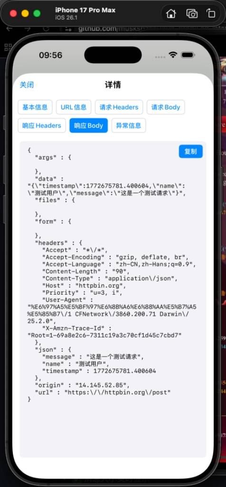
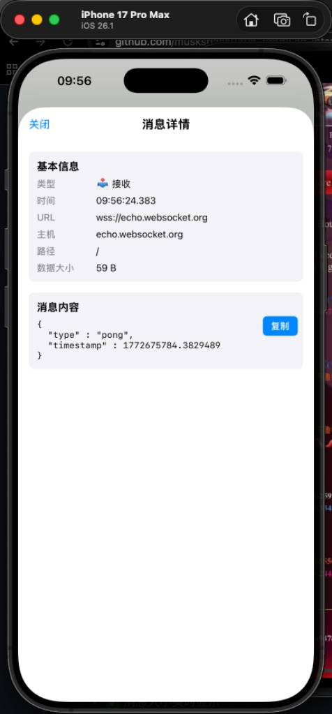

# ZWB_LogTap

[](https://github.com/muskspace0806-prog/Log-interception)
[](https://github.com/muskspace0806-prog/Log-interception)
[](https://swift.org)
[](LICENSE)
[](https://cocoapods.org/pods/ZWB_LogTap)

一个功能强大的 iOS 网络调试工具，支持 HTTP/HTTPS 和 WebSocket 实时拦截与查看。

[English](README_EN.md) | 中文文档

## ✨ 功能特性

- ✅ **HTTP/HTTPS 拦截** - 拦截所有 URLSession 网络请求（稳定）
- ✅ **Alamofire 支持** - 自动拦截 Alamofire 请求（稳定）
- ❌ **WebSocket 拦截** - 由于技术限制已禁用，建议使用专业工具
- ✅ **失败请求高亮** - 错误请求 URL 自动标红，一目了然
- ✅ **实时查看** - 实时显示请求和响应数据
- ✅ **JSON 格式化** - 自动格式化 JSON 数据，易于阅读
- ✅ **搜索过滤** - 快速搜索和过滤网络请求
- ✅ **日志导出** - 支持导出日志为 JSON 格式
- ✅ **悬浮按钮** - 可拖拽的悬浮按钮，随时查看日志
- ✅ **零配置** - 一行代码即可启动
- ✅ **仅 Debug** - 只在开发环境使用，不影响生产环境

## 📱 预览

### HTTP 网络日志

<p align="center">
  
  
</p>

**特性：**
- ✅ 失败请求 URL 自动标红（404、500、网络错误等）
- ✅ 状态码颜色区分（绿色=成功，红色=错误）
- ✅ 请求耗时实时显示
- ✅ 支持 GET、POST、PUT、DELETE 等方法
- ✅ JSON 自动格式化
- ✅ 完整的请求/响应详情查看

### WebSocket 消息

<p align="center">
  
  
</p>

**特性：**
- ✅ 错误消息 URL 和内容自动标红
- ✅ 消息类型图标区分（连接、发送、接收、错误）
- ✅ JSON 自动格式化
- ✅ 消息大小实时显示
- ✅ 完整的消息内容查看

### 界面特性
- ✅ 悬浮按钮，可拖拽移动
- ✅ HTTP/IM 模式快速切换
- ✅ 搜索和过滤功能
- ✅ 一键清空和导出日志

## 📦 安装

### CocoaPods

在你的 `Podfile` 中添加：

```ruby
# 仅在 Debug 模式下使用
pod 'ZWB_LogTap', '~> 1.0.4', :configurations => ['Debug']
```

然后运行：

```bash
pod install
```

### Swift Package Manager

```swift
dependencies: [
    .package(url: "https://github.com/muskspace0806-prog/Log-interception.git", from: "1.0.4")
]
```

### 手动安装

将 `ZWB_LogTap/Classes` 文件夹拖入你的项目。

## 🚀 快速开始

### 基础使用

在 `AppDelegate.swift` 中：

```swift
import ZWB_LogTap

func application(_ application: UIApplication, didFinishLaunchingWithOptions launchOptions: [UIApplication.LaunchOptionsKey: Any]?) -> Bool {
    
    // 方式 1: 仅在 Debug 模式下自动启动（推荐）
    ZWBLogTap.startIfDebug()
    
    // 方式 2: 手动启动
    #if DEBUG
    ZWBLogTap.shared.start()
    #endif
    
    return true
}
```

就这么简单！运行应用后，你会在右下角看到一个蓝色的悬浮按钮 📊。

### 高级配置

```swift
import ZWB_LogTap

// 自定义配置
var config = ZWBLogTap.Configuration()
config.showFloatingButton = true          // 显示悬浮按钮
config.interceptHTTP = true               // 拦截 HTTP 请求
config.maxRecords = 1000                  // 最大记录数

ZWBLogTap.shared.start(with: config)

// 或使用便捷方法
ZWBLogTap.start(
    showFloatingButton: true,
    interceptHTTP: true,
    maxRecords: 500
)
```

### ❌ WebSocket 拦截说明

WebSocket 拦截功能由于技术限制已**永久禁用**。

**原因：**
- Method Swizzling 在 Swift 环境下极度不稳定
- 即使最简单的操作（print、变量赋值）都会导致崩溃
- 无法在 SocketRocket 的 Hook 回调中执行任何 Swift 代码

**✅ 推荐方案：手动日志记录**

在你的 SocketRocket delegate 中添加几行代码即可：

```swift
import SocketRocket
import ZWB_LogTap

class MyWebSocketManager: NSObject, SRWebSocketDelegate {
    
    var webSocket: SRWebSocket?
    let wsURL = "wss://echo.websocket.org"
    
    // 连接
    func connect() {
        let url = URL(string: wsURL)!
        webSocket = SRWebSocket(url: url)
        webSocket?.delegate = self
        webSocket?.open()
        
        // 📝 记录连接
        ZWBLogTap.logWebSocketConnect(url: wsURL)
    }
    
    // 发送消息
    func sendMessage(_ message: String) {
        webSocket?.send(message)
        
        // 📝 记录发送
        ZWBLogTap.logWebSocketSend(url: wsURL, message: message)
    }
    
    // MARK: - SRWebSocketDelegate
    
    // 接收消息
    func webSocket(_ webSocket: SRWebSocket, didReceiveMessage message: Any) {
        // 📝 记录接收 - 只需添加这一行！
        ZWBLogTap.logWebSocketReceive(url: webSocket.url?.absoluteString ?? "", message: message)
        
        // 你的业务逻辑
        if let text = message as? String {
            print("收到文本: \(text)")
        }
    }
    
    // 连接失败
    func webSocket(_ webSocket: SRWebSocket, didFailWithError error: Error) {
        // 📝 记录错误
        ZWBLogTap.logWebSocketError(url: webSocket.url?.absoluteString ?? "", error: error.localizedDescription)
    }
    
    // 连接关闭
    func webSocket(_ webSocket: SRWebSocket, didCloseWithCode code: Int, reason: String?, wasClean: Bool) {
        // 📝 记录断开
        ZWBLogTap.logWebSocketDisconnect(url: webSocket.url?.absoluteString ?? "", reason: reason)
    }
}
```

**WebSocket 手动日志 API：**

```swift
// 1. 记录连接
ZWBLogTap.logWebSocketConnect(url: "wss://example.com")

// 2. 记录发送
ZWBLogTap.logWebSocketSend(url: "wss://example.com", message: "Hello")

// 3. 记录接收
ZWBLogTap.logWebSocketReceive(url: "wss://example.com", message: "World")

// 4. 记录断开
ZWBLogTap.logWebSocketDisconnect(url: "wss://example.com", reason: "正常关闭")

// 5. 记录错误
ZWBLogTap.logWebSocketError(url: "wss://example.com", error: "连接超时")
```

**查看日志：**
1. 运行应用
2. 点击右下角悬浮按钮 📊
3. 切换到 "IM" 标签
4. 查看所有 WebSocket 消息

**详细文档：**
- 📖 [WebSocket 手动日志完整指南](WEBSOCKET_MANUAL_LOGGING.md)
- 📋 [快速参考](QUICK_WEBSOCKET_GUIDE.md)

**其他替代方案：**
- ✅ **Charles Proxy** - 专业的网络调试工具，完美支持 WebSocket
- ✅ **Proxyman** - macOS 原生网络调试工具

## 📖 使用方法

### 查看日志

1. **点击悬浮按钮** - 打开日志列表页面
2. **切换 HTTP/IM** - 查看不同类型的日志
3. **点击列表项** - 查看详细信息
4. **搜索和过滤** - 快速找到目标请求
5. **复制内容** - 点击复制按钮复制数据

### 编程方式访问

```swift
// 显示日志页面
ZWBLogTap.shared.showLogViewController()

// 获取所有 HTTP 请求
let requests = ZWBLogTap.shared.getAllHTTPRequests()

// 获取所有 WebSocket 消息
let messages = ZWBLogTap.shared.getAllWebSocketMessages()

// 清空日志
ZWBLogTap.shared.clearAllLogs()

// 导出日志为 JSON
if let json = ZWBLogTap.shared.exportLogsAsJSON() {
    print(json)
}

// 停止调试工具
ZWBLogTap.shared.stop()
```

## 🔧 支持的网络库

### HTTP/HTTPS
- ✅ URLSession (原生)
- ✅ Alamofire
- ✅ AFNetworking
- ✅ 其他基于 URLSession 的库

### WebSocket
- ✅ SocketRocket
- ⚠️ URLSessionWebSocketTask (需要额外配置)
- ✅ 其他基于 NSStream 的实现

## 💡 最佳实践

### 1. 仅在 Debug 模式使用

```swift
#if DEBUG
ZWBLogTap.shared.start()
#endif
```

### 2. 在 Podfile 中限制配置

```ruby
pod 'ZWB_LogTap', '~> 1.0.3', :configurations => ['Debug']
```

### 3. 内存管理

```swift
func applicationDidReceiveMemoryWarning(_ application: UIApplication) {
    #if DEBUG
    ZWBLogTap.shared.clearAllLogs()
    #endif
}
```

### 4. 自定义过滤

如果需要忽略某些请求，可以修改 `NetworkInterceptor.swift`:

```swift
override class func canInit(with request: URLRequest) -> Bool {
    // 忽略特定域名
    if request.url?.host?.contains("analytics.com") == true {
        return false
    }
    return true
}
```

## ⚠️ 注意事项

1. **仅用于开发/测试** - 不要在生产环境启用
2. **性能影响** - 拦截会略微增加网络请求开销
3. **内存占用** - 大量请求会占用内存，定期清空日志
4. **隐私安全** - 日志可能包含敏感信息，注意保护
5. **App Store** - 上架前确保已禁用或移除

## 📋 系统要求

- iOS 13.0+
- Xcode 12.0+
- Swift 5.0+

## 🤝 贡献

欢迎提交 Issue 和 Pull Request！

1. Fork 项目
2. 创建特性分支 (`git checkout -b feature/AmazingFeature`)
3. 提交更改 (`git commit -m 'Add some AmazingFeature'`)
4. 推送到分支 (`git push origin feature/AmazingFeature`)
5. 开启 Pull Request

## 📝 更新日志

### [1.0.3] - 2026-03-04

#### Added
- 错误请求 URL 自动标红显示
- WebSocket 错误消息高亮显示
- 优化错误请求的视觉展示

### [1.0.2] - 2026-03-04

#### Added
- 初始版本发布
- HTTP/HTTPS 拦截功能
- WebSocket 拦截功能（支持 SocketRocket）
- 悬浮按钮 UI
- 日志列表和详情页面
- JSON 自动格式化
- 搜索和过滤功能
- 日志导出功能

## 📄 许可证

ZWB_LogTap 使用 MIT 许可证。详见 [LICENSE](LICENSE) 文件。

## 👨‍💻 作者

ZWB - [@muskspace0806-prog](https://github.com/muskspace0806-prog)

项目链接: [https://github.com/muskspace0806-prog/Log-interception](https://github.com/muskspace0806-prog/Log-interception)

CocoaPods: [https://cocoapods.org/pods/ZWB_LogTap](https://cocoapods.org/pods/ZWB_LogTap)

## 🙏 致谢

- 感谢所有贡献者

## ⭐️ 支持

如果这个项目对你有帮助，请给个 Star！

---

Made with ❤️ by ZWB
